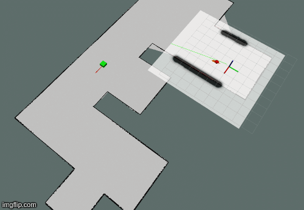

# Project 5: Home Service Robot

In this project, a mobile robot is asked to navigate to a pick-up zone for picking 
up a green cube. After that, it moves while carrying the cube to the drop-off
zone position and drops the cube there.

<a href="https://www.youtube.com/watch?v=aWmFmcCNxjw" target="_blank">
</a>

## How it works
The mobile robot first drives around and scan the house using laser for generating 
a static map about this place. Having the map, it uses odometry and laser data 
to localize itself with adaptive monte carlo localization (AMCL). Upon receiving 
a navigation goal, it plans forward the trajectory using Dijkstra's algorithm and 
navigate to the goal.

## Description
The project consists of the following parts:
1. A Gazebo world and a mobile robot.
2. ROS packages: [map_server](http://wiki.ros.org/map_server), 
[amcl](http://wiki.ros.org/amcl), [move_base](http://wiki.ros.org/move_base),
[slam-gmapping](http://wiki.ros.org/slam_gmapping) 
and [teleop_twist_keyboard](http://wiki.ros.org/teleop_twist_keyboard).

## Prequisites
1. ROS (Melodic or Kinetic), Gazebo on Linux
2. CMake & g++/gcc, C++11
3. Install xterm `sudo apt-get install xterm`
4. Python with pip
5. Install some dependencies
```
$ sudo apt-get update && sudo apt-get upgrade -y
$ sudo apt-get install ros-${ROS_DISTRO}-map-server
$ sudo apt-get install ros-${ROS_DISTRO}-amcl
$ sudo apt-get install ros-${ROS_DISTRO}-move-base
$ sudo apt-get install ros-${ROS_DISTRO}-slam-gmapping
$ pip install rospkg
```

## Setup, Build and Launch
1. Install Gazebo and ROS(melodic/kinetic) on Linux.

2. Clone the project in a catkin workspace
```
$ mkdir catkin_ws
$ cd catkin_ws
$ git clone https://github.com/huuanhhuynguyen/RoboND-Home-Service-Robot.git
$ mv RoboND-Home-Service-Robot src
$ cd src && catkin_init_workspace
```

3. Navigate back to the `catkin_ws`folder and build the project
```
$ catkin_make
```

4. Run available scripts to launch
```
$ source devel/setup.bash
$ chmod u+x ./src/scripts/home_service.sh
$ ./src/scripts/home_service.sh
```
Note: To redraw the map, close all ros terminals and re-run the script 
`test_slam.sh` instead. While all terminal is open, run 
`rosrun map_server map_saver -f my_map`. Replace the `map/SimpleMap` files with 
the newly created `my_map`.

## Final Words

This project is the final project of Udacity Robotics Software Engineer Nanodegree,
in which the following knowledge are combined:
* Apply and fine tune the AMCL algorithm.
* Apply and fine tune cost map and trajectory planner of move_base ROS package.
* Write ROS nodes with publishers and subscribers
